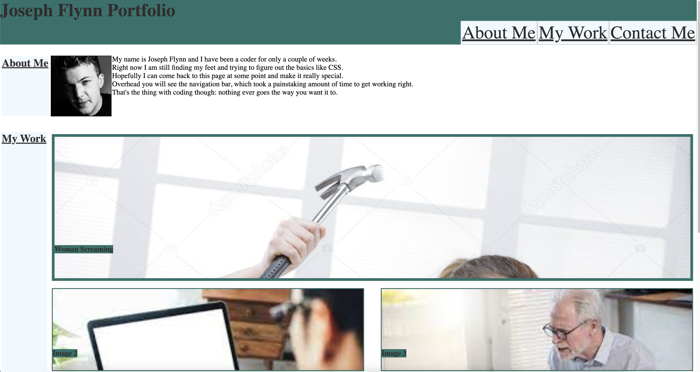

# OSU-Bootcamp-Challenge-2
The second challenge of the OSU bootcamp
## HTML
In the HTML I set up the page with a header and navigation menu, and below that I broke it up into sections. Each section is filled with content specific to that section, including an about me page, images with links, and contact info. To get a lot of the functionality working in the code, I had to give a lot of the elements their own classes or ids, especially the images, since I wanted them to have a nice hover effect. Embedding links made a lot of the code look messy, but I think that the effectiveness outweighs the appearance.
## CSS
The CSS gave me a lot more trouble, as many elements simply didn't do what I wanted them to. The navigation bar took me many hours to get working how I wanted it, and the images in the work section refused a lot of my efforts. I could get them working in the HTML side of things, but the CSS simply refused any of my commands, especially flexboxes, which didn't want to work. Eventually I figured out that I had made a div tag and made some CSS additions to it which kept overriding everything else. Getting rid of it solved everything. After that, I played around with image spacing so it looked more like a gallery than a weirdly stacked set of images. After getting some help from a tutor and in office hours I got it working.
Screenshot:

Link to site:https://alphastranger.github.io/OSU-Bootcamp-Challenge-2/